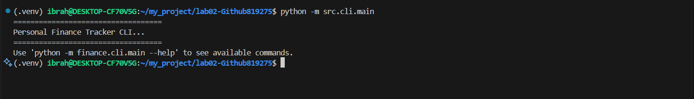
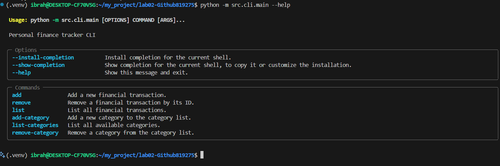
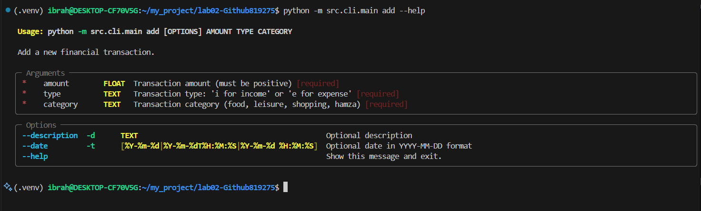
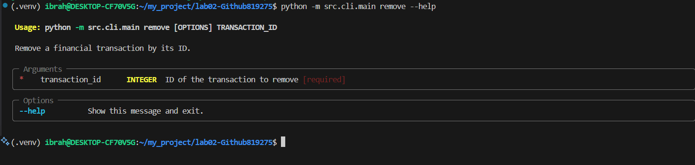
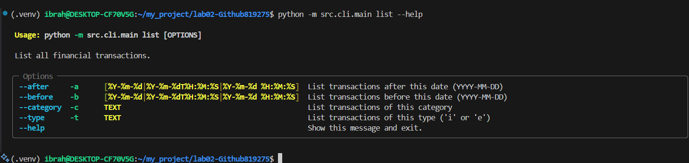
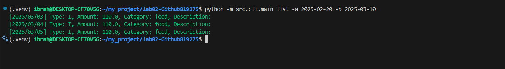
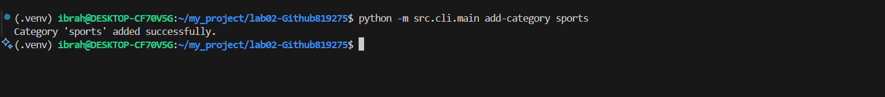
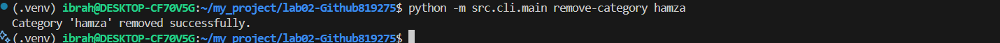
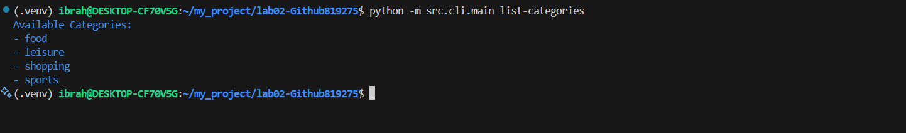
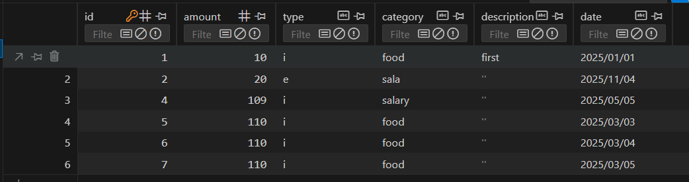

[](https://classroom.github.com/a/0HFAQCrw)


# Finance Tracker CLI

A command-line personal finance tracker that lets you log income and expenses, organize them into categories, and track your spending habits using SQLite as the backend storage.

## Features

- Add and remove financial transactions (income/expenses)
- Categorize transactions with customizable categories 
- List transactions with flexible filters:
  - Date range filtering (`--before`/`--after`)
  - Category filtering (`--category`)
  - Transaction type filtering (`--type`)
- Manage transaction categories (add/remove/list)
- Persistent storage using SQLite database
- Report option to print summary tables and save a barchart(report.png) to docs folder




## Installation

1. Ensure you have Python 3.12+ installed:
```sh
python --version
```

2. Create and activate a virtual environment:
```sh
python -m venv .venv
source .venv/bin/activate  # On Unix/macOS
# or
.venv\Scripts\activate     # On Windows
```

3. Install dependencies using `uv`:
```sh
uv sync
```

## Usage

The CLI provides several commands for managing your finances:

### Transaction Management

1. Add a transaction:
```sh
python -m src.cli.main add 100.50 i salary --description "Monthly salary" --date 2024-02-01
```



2. Remove a transaction according to its ID:
```sh
python -m src.cli.main remove 1
```




3. List transactions:
```sh
# List all transactions
python -m src.cli.main list



# List with filters
python -m src.cli.main list --after 2024-01-01 --before 2024-02-01
python -m src.cli.main list --category food --type e
```



### Category Management

1. Add a new category:
```sh
python -m src.cli.main add-category groceries
```


2. Remove a category:
```sh
python -m src.cli.main remove-category groceries
```


3. List all categories:
```sh
python -m src.cli.main list-categories
```


## Backend Selection

The application uses SQLite as its backend storage engine. The database file (`finance.db`) is created automatically in the root directory when you first run the application. For changes to show in the database, the file has to reopened if it was already open, or you can press the reload button in the top left corner.

The database schema includes a single table `transactions` with the following structure:
- `id`: Integer (Primary Key)
- `amount`: Real
- `type`: Text ('i' for income, 'e' for expense)
- `category`: Text
- `description`: Text
- `date`: Text (YYYY/MM/DD format)



Categories are stored separately in a text file at `src/categories/category_list.txt`.

## Development

### Project Structure

```
src/
├── application/        # Contains the transaction service
├── categories/         # Category management + File used to store them
├── cli/               # CLI interface (Typer)
├── domain/            # Transaction DTO, Data Transfer Object
└── infrastructure/    # Database implementation, using sqlite3
```

### Running Tests

```sh
pytest
```

### Code Quality

Run the following commands to ensure code quality:

```sh
ruff check .                              # Linting
pyrefly check src --search-path .         # Type checking
```
